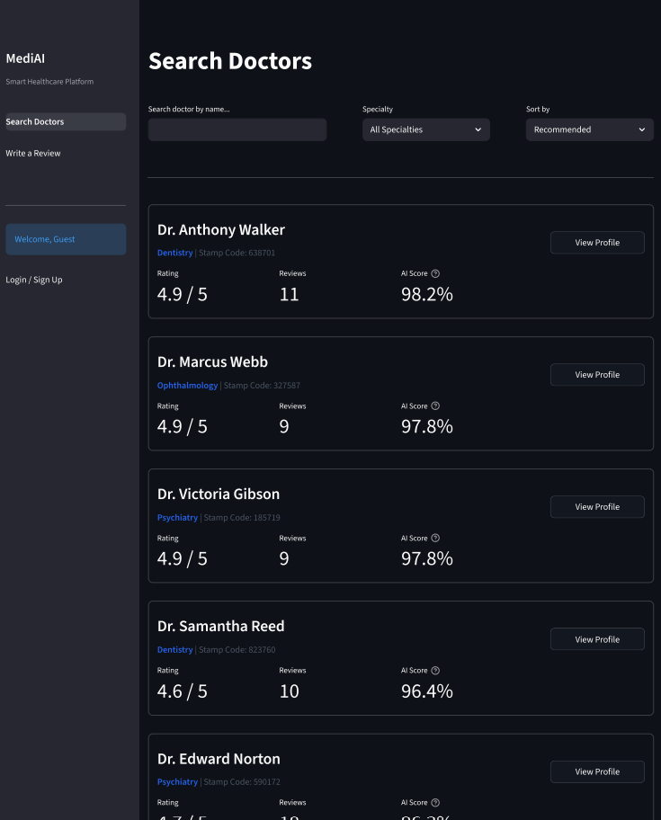
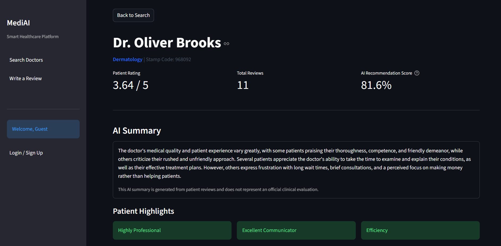
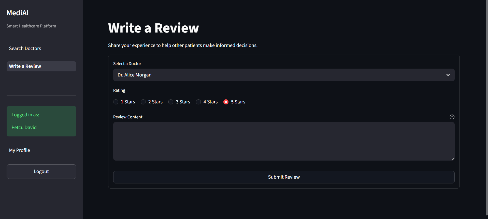
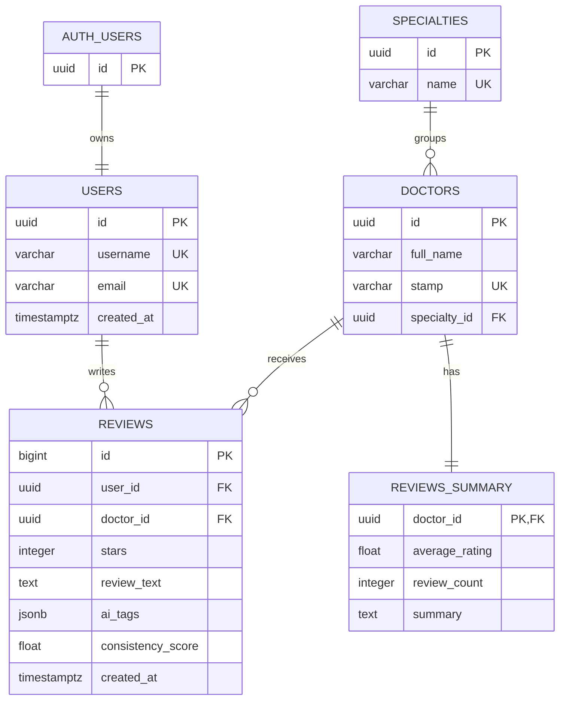

# MediAI

**English** | [Română](README_RO.md)

MediAI is a Streamlit application for searching doctors and exploring patient feedback. It combines conventional ratings with AI generated tags, review consistency analysis, doctor summaries, and a recommendation score calculated in Python.

The project was developed as a bachelor's thesis prototype. Its doctor profiles and imported reviews are demonstration data and must not be interpreted as verified medical information or clinical assessments.



## Features

- Search doctors by name and filter them by medical specialty.
- Sort profiles by recommendation score, rating, or review count.
- View doctor ratings, recent patient reviews, AI summaries, and positive highlights.
- Register and log in through Supabase Auth.
- Submit one review per doctor per UTC calendar day.
- Compare a user's star rating with an AI estimated rating to calculate an AI Trust Score.
- Reprocess unfinished reviews with a recovery batch script.
- Delete personal reviews and recalculate the affected doctor's statistics and summary.

## AI Processing

When a review is submitted, the application stores it in Supabase and starts a background worker. The worker uses `openai/gpt-oss-20b` through the Groq API to extract tags and estimate a star rating. The difference between the user rating and the AI estimate produces a consistency score between 0 and 1.

The worker then uses `openai/gpt-oss-120b` to summarize the latest 20 reviews for the doctor. Summaries describe reported patient experiences and are not official evaluations of medical quality.

The doctor recommendation score is calculated dynamically in Python:

```text
Recommendation Score = Rating Points + Trust Points + Popularity Points
Rating Points         = (Average Rating / 5) * 45
Trust Points          = Average Consistency Score * 45
Popularity Points     = min(10, Review Count * 2)
```

## Screenshots

### Doctor Profile



### Review Submission



## Technology Stack

- Python 3.14
- Streamlit
- Supabase and PostgreSQL
- Groq API
- GPT OSS 20B and GPT OSS 120B
- Supabase Auth and Row Level Security
- pandas

## Database Schema

The application uses five public PostgreSQL tables. User profiles are linked to identities managed by Supabase Auth.



## Project Structure

```text
app.py                         Application entry point
pages/                         Streamlit pages
sidebar.py                     Shared navigation and session controls
database.py                    Supabase client configuration
auth_session.py                Isolated Supabase Auth sessions for Streamlit users
ai_engine.py                   Groq calls, review analysis, and summaries
ai_worker.py                   Background processing for live changes
ai_batch_processor.py          Recovery processing for pending reviews
ai_summary_generator.py        Regenerates summaries for every doctor
seed_database.py               Creates demonstration users and doctors
smart_import.py                Imports and processes demonstration reviews
db_validations.sql             Database constraints and daily uniqueness index
supabase_auth_rls.sql          Supabase Auth trigger, grants, and RLS policies
```

## Local Setup

1. Create and activate a virtual environment:

```powershell
py -3.14 -m venv .venv
.\.venv\Scripts\Activate.ps1
```

2. Install the dependencies:

```powershell
python -m pip install --upgrade pip setuptools wheel
python -m pip install -r requirements.txt
```

3. Create a Supabase project with the following tables:

- `users`
- `specialties`
- `doctors`
- `reviews`
- `reviews_summary`

The expected table relationships and columns are reflected by the queries in the application. After creating the tables, run `db_validations.sql` and `supabase_auth_rls.sql` in the Supabase SQL Editor.

4. Create the local environment file:

```powershell
Copy-Item .env.example .env
```

Fill in the environment variables. `SUPABASE_KEY` must contain the publishable key. `SUPABASE_SECRET_KEY` is used only by server-side workers and maintenance scripts and must never be exposed to a browser or committed to Git.

5. Optionally create the demonstration users, specialties, and doctors:

```powershell
python seed_database.py
```

6. Start the application:

```powershell
streamlit run app.py
```

## Optional Review Import

The external CSV dataset is intentionally excluded from this repository because it is large and is not authored as part of the project. Its records are processed as demonstration data before insertion.

Set `REVIEW_DATASET_PATH` in `.env` or pass the path directly:

```powershell
python smart_import.py --dataset "C:\path\to\2021_german_doctor_reviews.csv"
```

After an import, pending AI fields can be processed and all summaries can be regenerated with:

```powershell
python ai_batch_processor.py
python ai_summary_generator.py
```

## Security Notes

- `.env`, virtual environments, IDE settings, local datasets, and generated thesis artifacts are excluded from Git.
- Passwords and sessions are managed by Supabase Auth.
- Row Level Security allows public reads while restricting review creation and deletion to the authenticated owner.
- The publishable key is used for public and user requests. The secret key is restricted to server-side AI workers and maintenance scripts.
- A production medical platform would also require stronger privacy controls, moderation, monitoring, audit logs, rate limiting, and formal security and compliance review.

## License

This project is available under the [MIT License](LICENSE).
