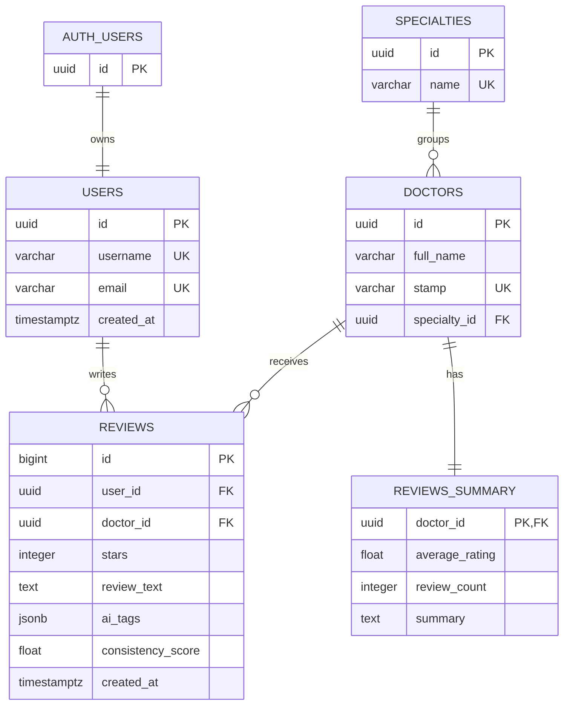

# MediAI

[English](README.md) | **Română**

MediAI este o aplicație Streamlit pentru căutarea medicilor și consultarea opiniilor pacienților. Aceasta combină ratingurile convenționale cu etichete generate de AI, analiza consistenței review-urilor, rezumate pentru medici și un scor de recomandare calculat în Python.

Proiectul a fost dezvoltat ca prototip pentru o lucrare de licență. Profilurile medicilor și review-urile importate reprezintă date demonstrative și nu trebuie interpretate ca informații medicale verificate sau evaluări clinice.


## Funcționalități

- Căutarea medicilor după nume și filtrarea după specialitatea medicală.
- Sortarea profilurilor după scorul de recomandare, rating sau numărul de review-uri.
- Afișarea ratingurilor, review-urilor recente, rezumatelor AI și evidențierilor pozitive.
- Înregistrarea și autentificarea prin Supabase Auth.
- Trimiterea unui singur review pentru același medic într-o zi calendaristică UTC.
- Compararea ratingului oferit de utilizator cu ratingul estimat de AI pentru calcularea AI Trust Score.
- Reprocesarea review-urilor rămase nefinalizate printr-un script batch de recuperare.
- Ștergerea review-urilor proprii și recalcularea statisticilor și a rezumatului medicului afectat.

## Procesarea AI

La trimiterea unui review, aplicația îl salvează în Supabase și pornește un worker în fundal. Worker-ul folosește modelul `openai/gpt-oss-20b` prin Groq API pentru a extrage etichete și a estima un rating. Diferența dintre ratingul utilizatorului și estimarea AI produce un scor de consistență între 0 și 1.

Worker-ul folosește apoi `openai/gpt-oss-120b` pentru a rezuma cele mai recente 20 de review-uri ale medicului. Rezumatele descriu experiențele raportate de pacienți și nu reprezintă evaluări oficiale ale calității medicale.

Scorul de recomandare al medicului este calculat dinamic în Python:

```text
Scor recomandare   = Puncte rating + Puncte încredere + Puncte popularitate
Puncte rating      = (Rating mediu / 5) * 45
Puncte încredere   = Scor mediu de consistență * 45
Puncte popularitate = min(10, Număr review-uri * 2)
```

## Capturi de ecran

### Profilul medicului


### Trimiterea unui review


## Tehnologii utilizate

- Python 3.14
- Streamlit
- Supabase și PostgreSQL
- Groq API
- GPT OSS 20B și GPT OSS 120B
- Supabase Auth și Row Level Security
- pandas

## Schema bazei de date

Aplicația folosește cinci tabele publice PostgreSQL. Profilurile utilizatorilor sunt asociate identităților gestionate de Supabase Auth.



## Structura proiectului

```text
app.py                         Punctul de intrare al aplicației
pages/                         Paginile Streamlit
sidebar.py                     Navigarea comună și controlul sesiunii
database.py                    Configurarea clienților Supabase
auth_session.py                Sesiuni Supabase Auth izolate pentru utilizatorii Streamlit
ai_engine.py                   Apeluri Groq, analiza review-urilor și rezumate
ai_worker.py                   Procesarea în fundal a modificărilor curente
ai_batch_processor.py          Recuperarea review-urilor rămase neprocesate
ai_summary_generator.py        Regenerarea rezumatelor tuturor medicilor
seed_database.py               Crearea utilizatorilor și medicilor demonstrativi
smart_import.py                Importul și procesarea review-urilor demonstrative
db_validations.sql             Constrângeri și indexul de unicitate zilnică
supabase_auth_rls.sql          Trigger Supabase Auth, permisiuni și politici RLS
```

## Configurare locală

1. Creează și activează un mediu virtual:

```powershell
py -3.14 -m venv .venv
.\.venv\Scripts\Activate.ps1
```

2. Instalează dependențele:

```powershell
python -m pip install --upgrade pip setuptools wheel
python -m pip install -r requirements.txt
```

3. Creează un proiect Supabase cu următoarele tabele:

- `users`
- `specialties`
- `doctors`
- `reviews`
- `reviews_summary`

Relațiile și coloanele necesare sunt reflectate de interogările aplicației. După crearea tabelelor, rulează `db_validations.sql` și `supabase_auth_rls.sql` în Supabase SQL Editor.

4. Creează fișierul local pentru variabilele de mediu:

```powershell
Copy-Item .env.example .env
```

Completează variabilele de mediu. `SUPABASE_KEY` trebuie să conțină cheia publishable. `SUPABASE_SECRET_KEY` este folosită numai de worker-ele server-side și scripturile de mentenanță și nu trebuie expusă în browser sau inclusă în Git.

5. Opțional, creează utilizatorii, specialitățile și medicii demonstrativi:

```powershell
python seed_database.py
```

6. Pornește aplicația:

```powershell
streamlit run app.py
```

## Importul opțional al review-urilor

Datasetul CSV extern este exclus intenționat din repository deoarece este mare și nu a fost creat ca parte a proiectului. Înregistrările sale sunt procesate ca date demonstrative înainte de inserare.

Setează `REVIEW_DATASET_PATH` în `.env` sau transmite direct calea:

```powershell
python smart_import.py --dataset "C:\path\to\2021_german_doctor_reviews.csv"
```

După import, câmpurile AI rămase neprocesate pot fi completate, iar rezumatele pot fi regenerate cu:

```powershell
python ai_batch_processor.py
python ai_summary_generator.py
```

## Observații privind securitatea

- `.env`, mediile virtuale, setările IDE, dataseturile locale și artefactele generate pentru licență sunt excluse din Git.
- Parolele și sesiunile sunt gestionate de Supabase Auth.
- Row Level Security permite citirea publică, dar restricționează crearea și ștergerea review-urilor la proprietarul autentificat.
- Cheia publishable este folosită pentru cererile publice și ale utilizatorilor. Cheia secretă este rezervată worker-elor server-side și scripturilor de mentenanță.
- O platformă medicală de producție ar necesita și controale mai stricte de confidențialitate, moderare, monitorizare, jurnale de audit, limitarea cererilor și evaluări formale de securitate și conformitate.

## Licență

Acest proiect este disponibil sub [licența MIT](LICENSE).
